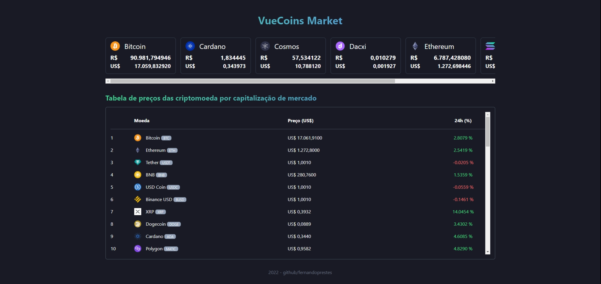
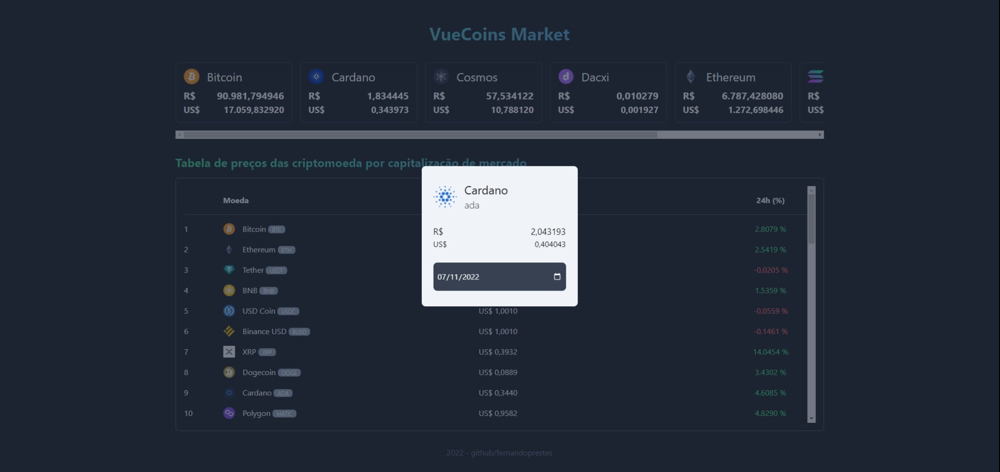

# VueCoins

Este projeto é uma aplicação que mostra o preços da criptomoeda usando a API [CoinGenko](https://www.coingecko.com/pt/api/documentation).

- [x] No topo abaixo do header conter 7 cards listado as moedas bitcoin, cardano, dacxi, ethereum, polkadoor, solana e terra luna 2 em reais e dólar.
- [x] Ao pressionar um dos cards abrir modal para filtra por data a cotação em real e dólar da moeda.
- [x] Lista em uma tabela o nome, o preço a a variação (%) das 50 moedas por capitalização

## Screenshots

## Tecnologias

- [Vite](https://vitejs.dev/)
- [Vue3](https://vuejs.org/)
- [Vue-Router](https://router.vuejs.org/)
- [Typescript](https://www.typescriptlang.org/)
- [tailwindcss](https://tailwindcss.com/)
- [Eslint](https://eslint.org/)
- [Eslint-plugin-vue](https://eslint.vuejs.org/)
- [Prettier](https://prettier.io/)
- [husky](https://typicode.github.io/husky/#/)
- [Animate.css](https://animate.style/)
- [CoinGecko](https://www.coingecko.com/pt/api/documentation)

### Ferramentas recomendadas

- [VSCode](https://code.visualstudio.com/)
- [Volar](https://marketplace.visualstudio.com/items?itemName=johnsoncodehk.volar)
- [ESLint](https://marketplace.visualstudio.com/items?itemName=dbaeumer.vscode-eslint)
- [Prettier](https://marketplace.visualstudio.com/items?itemName=esbenp.prettier-vscode)
- [Vite](https://marketplace.visualstudio.com/items?itemName=antfu.vite)

---

2022 - [github.com/fernandoprestes](https://github.com/fernandoprestes)
